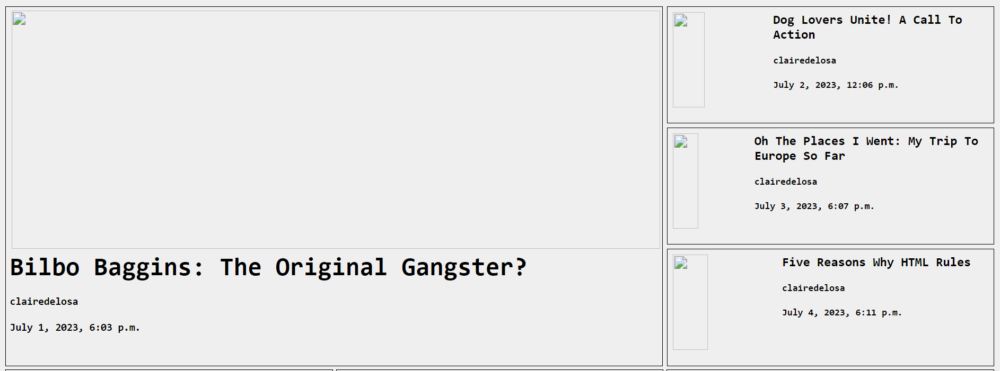
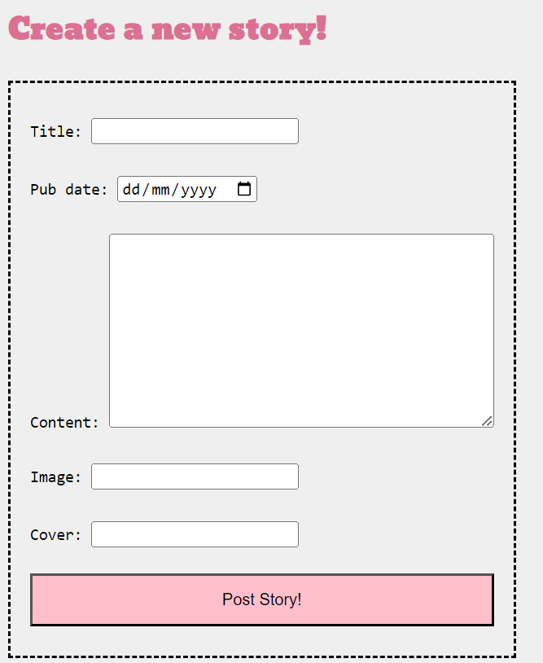
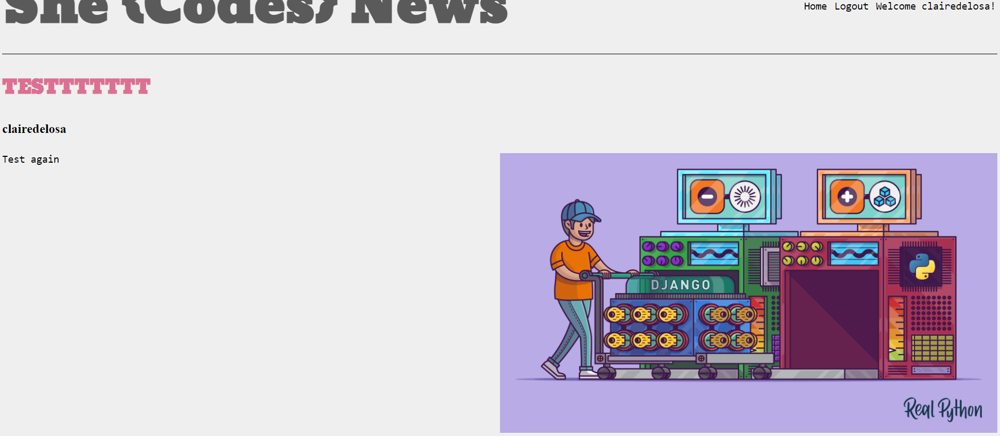
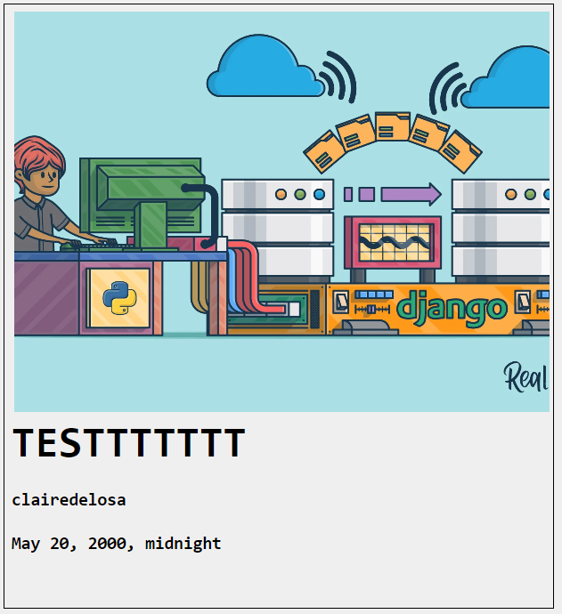
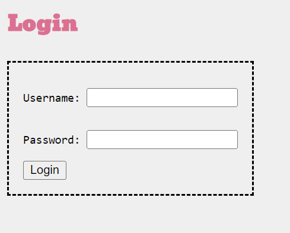
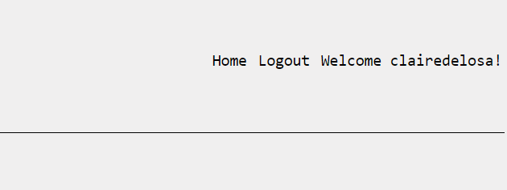
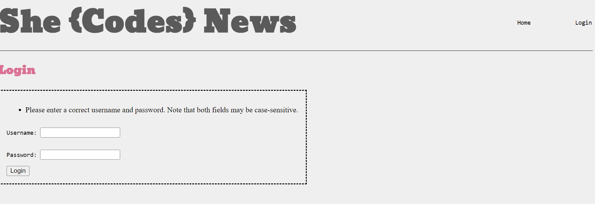
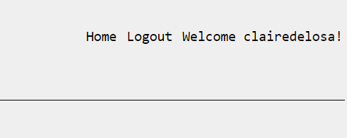
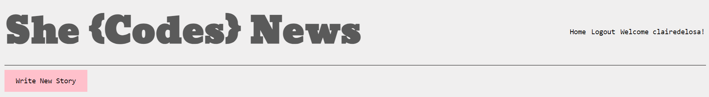
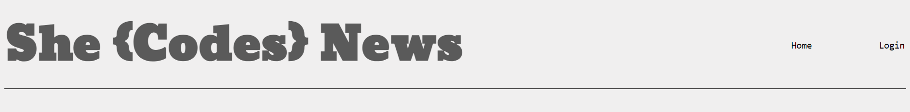

# Claire Delosa - She Codes News Project

## About This Project
This is the She Codes news app. You can create an account, login and out, create a news story and post it, and also view other news stories.

## How To Run This Code
- Clone the repo to your local machine
- Create a virtual environment
- Migrate the database
- Run the server then view the web app : http://127.0.0.1:8000/news/

## Project Features- 

- [X] Order stories by date

- [X] Styled "new story" form

- [X] Story images

- [X] Log-in/log-out

- [X] "Log-in" button only visible when no user is logged in/"Log-out" button only visible when a user *is* logged in

- [X] "Create Story" functionality only available when user is logged in

